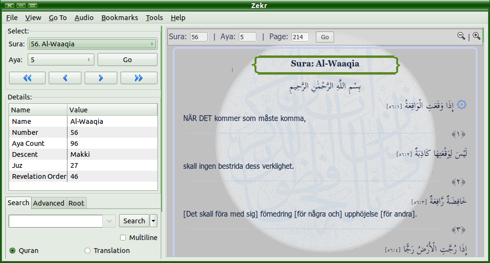

# Zekr
> - Zekr is an open platform for Quran study, designed for browsing and researching the Quran. However, as the main website of this software is currently inaccessible, support has become limited due to the lack of maintenance.
> - This repository contains the installation files and supporting runtime for the Windows operating system, which has been tested on Windows 10. It also includes translation files and fonts.
> - At present, installation files are only included for Windows 64-bit. In the future, I plan to add files for Linux as well, InshaAllah.

## Previews

<!--
## Installation Guide on Windows 10

## Installation Guide on Linux

## Recitation Files
-->
